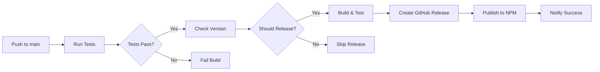

# CI/CD Setup Guide

This document describes the CI/CD setup for automated testing and NPM publishing.

## Overview

The WildDuck client library uses GitHub Actions for continuous integration and deployment. Every push to the `main` branch triggers automated testing and, if tests pass, publishes a new version to NPM.

## Workflow Summary



## Files

- **`.github/workflows/ci-cd.yml`** - Main CI/CD workflow
- **`.github/workflows/README.md`** - Detailed workflow documentation

## Quick Start

### 1. Configure NPM Token

1. Create an NPM automation token:
   - Go to <https://www.npmjs.com/settings/YOUR_USERNAME/tokens>
   - Click "Generate New Token"
   - Select "Automation" type
   - Save the token securely

2. Add token to GitHub repository:
   - Go to your repository on GitHub
   - Settings → Secrets and variables → Actions
   - Click "New repository secret"
   - Name: `NPM_TOKEN`
   - Value: Your NPM token
   - Click "Add secret"

### 2. Release a New Version

1. **Update version** in `package.json`:

   ```bash
   npm version patch  # For bug fixes (0.0.1 → 0.0.2)
   npm version minor  # For new features (0.0.1 → 0.1.0)
   npm version major  # For breaking changes (0.0.1 → 1.0.0)
   ```

2. **Commit and push**:

   ```bash
   git add package.json package-lock.json
   git commit -m "Release v0.0.2"
   git push origin main
   ```

3. **Automated process**:
   - CI/CD runs tests on Node 20.x and 22.x
   - If tests pass, builds the project
   - Creates GitHub release with tag `v0.0.2`
   - Publishes to NPM: `@sudobility/wildduck_client@0.0.2`
   - Sends notifications

## What Gets Tested

### ✅ Tests That Run in CI/CD

- **Type Checking**: TypeScript compilation (`npm run typecheck`)
- **Linting**: ESLint checks (`npm run lint`)
- **Unit Tests**: All unit tests (`npm run test:run`)
- **Build**: Production build (`npm run build`)
- **Coverage**: Test coverage report (`npm run test:coverage`)

### ⏭️ Tests That DON'T Run in CI/CD

- **Integration Tests**: `npm run test:integration`
  - Skipped because they require a live WildDuck server
  - Run these locally before pushing:

    ```bash
    WILDDUCK_ENDPOINT=http://localhost:8080 npm run test:integration
    ```

## Workflow Jobs

### Job 1: Test (Parallel)

Runs on both Node.js 20.x and 22.x:

```yaml
- Type checking
- Linting
- Unit tests
- Build
```

**Duration**: ~2-3 minutes per Node version

### Job 2: Check for Release

Determines if a release should happen:

- ✅ Release: Push to main with version change
- ⏭️ Skip: Commit contains `[skip ci]`
- ⏭️ Skip: Unmerged PR

**Duration**: ~10 seconds

### Job 3: Release to NPM

Only runs if tests pass and release is needed:

```yaml
1. Install dependencies
2. Run coverage tests
3. Build project
4. Verify build output
5. Create GitHub Release
6. Publish to NPM
7. Notify success/failure
```

**Duration**: ~2-3 minutes

## GitHub Release Format

Each release includes:

### Release Title

```text
Release v0.0.2
```

### Release Body

```markdown
## WildDuck Email Client v0.0.2

Features, installation instructions, quick start guide, API coverage,
documentation links, testing instructions, and auto-generated changelog.
```

### Release Artifacts

- Source code (zip & tar.gz)
- Auto-generated release notes from commits

## NPM Package

Published to: <https://www.npmjs.com/package/@sudobility/wildduck_client>

### Package Contents

- `dist/` - Compiled JavaScript and TypeScript definitions
- `package.json` - Package metadata
- `README.md` - Package documentation
- All files specified in `package.json` `files` field

### Installation

```bash
npm install @sudobility/wildduck_client@latest
```

## Version Strategy

We follow [Semantic Versioning](https://semver.org/):

- **MAJOR** (x.0.0): Breaking changes
  - API changes that aren't backward compatible
  - Removed features
  - Changed behavior that breaks existing code

- **MINOR** (0.x.0): New features
  - New API endpoints
  - New hooks or utilities
  - Backward-compatible enhancements

- **PATCH** (0.0.x): Bug fixes
  - Bug fixes
  - Performance improvements
  - Documentation updates
  - Internal refactoring

## Skip CI/CD

To skip the CI/CD pipeline for documentation or non-code changes:

```bash
git commit -m "Update README [skip ci]"
```

This will:

- ✅ Still run tests
- ⏭️ Skip creating a release
- ⏭️ Skip publishing to NPM

## Local Verification

Before pushing, run the same checks locally:

```bash
# Install dependencies (clean install)
npm ci

# Run all CI/CD checks
npm run typecheck
npm run lint
npm run test:run
npm run build

# Optional: Run integration tests
WILDDUCK_ENDPOINT=http://localhost:8080 npm run test:integration

# Optional: Check coverage
npm run test:coverage
```

## Troubleshooting

### Tests Fail in CI/CD

1. Run tests locally: `npm run test:run`
2. Check type errors: `npm run typecheck`
3. Fix linting issues: `npm run lint:fix`
4. Verify build: `npm run build`

### NPM Publish Fails

Check:

- [ ] `NPM_TOKEN` secret is configured
- [ ] Token has "Automation" type and write permissions
- [ ] Version in `package.json` is incremented
- [ ] Package name is correct: `@sudobility/wildduck_client`
- [ ] Version doesn't already exist on NPM

### GitHub Release Fails

Check:

- [ ] Workflow has `contents: write` permission (already configured)
- [ ] Version tag doesn't already exist
- [ ] Repository allows workflows to create releases

### Build Output Issues

Verify build contents:

```bash
npm run build
ls -la dist/
head dist/index.js
head dist/index.d.ts
```

## Monitoring

### View Workflow Runs

<https://github.com/johnqh/wildduck_client/actions/workflows/ci-cd.yml>

### Check NPM Package

<https://www.npmjs.com/package/@sudobility/wildduck_client>

### View Releases

<https://github.com/johnqh/wildduck_client/releases>

## Best Practices

1. **Test Locally First**: Always run tests locally before pushing
2. **Increment Version**: Use `npm version` to update version
3. **Clear Commit Messages**: Describe what changed
4. **Review Coverage**: Check test coverage before release
5. **Verify Integration**: Test with real server when possible
6. **Document Changes**: Update README/docs with new features
7. **Check Dependencies**: Keep dependencies up to date

## Security

- **Never commit** `NPM_TOKEN` to the repository
- Use GitHub Secrets for all sensitive data
- Use automation tokens, not personal access tokens
- Review workflow permissions regularly
- Keep workflow actions up to date

## Support

For issues with CI/CD:

1. Check the workflow run logs
2. Review this documentation
3. Open an issue on GitHub
4. Contact the maintainers

---

**Last Updated**: 2025-10-24
**Package Version**: 1.0.5
**Workflow Version**: 1.0.0
